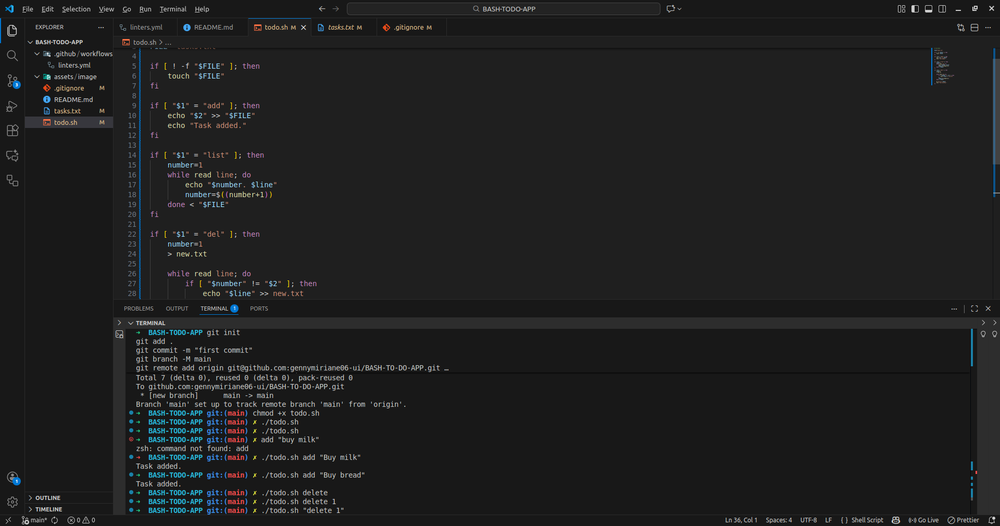

# BASH-TO-DO-APPLICATION

[](opensource.org)

## OVERVIWWS

This project is a simple, command-line interface (CLI) to-do list application built entirely in **Bash**. It allows users to manage their daily tasks directly from the terminal without relying on complex frameworks or external dependencies.
Tasks are stored locally in a plain text file, ensuring simplicity and portability

## FEATURES

* Add Tasks: Quickly add new tasks with a simple command.
* List Tasks: View all pending and completed tasks.
* Mark as Complete: Easily toggle task status.
* Delete Tasks: Remove unwanted items from the list.
* Persistent Storage: Tasks remain saved between sessions.

## Prerequisites

Since this is a Bash script, the only prerequisite is a modern Linux or macOS environment with Bash installed (which is standard on most systems).

* Bash: Version 4.0 or higher is recommended.
* Core Utilities: Standard tools like `grep`, `sed`, `awk`, and `cat` are required.

## GET STARTED

To start do ./todo.sh

## Installation

1.Clone the repository:
    ```bash
    git clone github.com
    cd BASH-TODO-APP
2.Make the script executable:
    ```bash
    chmod +x todo.sh

3.(Optional) Add to your PATH:
    For easy access from anywhere in your terminal, move the script to a directory included in your system's `PATH` (e.g., `/usr/local/bin`):

    ```bash
    sudo mv todo.sh /usr/local/bin/todo
    ```
    Now you can run the app just by typing `todo` anywhere.

## Usage

Run the script by executing the file directly
